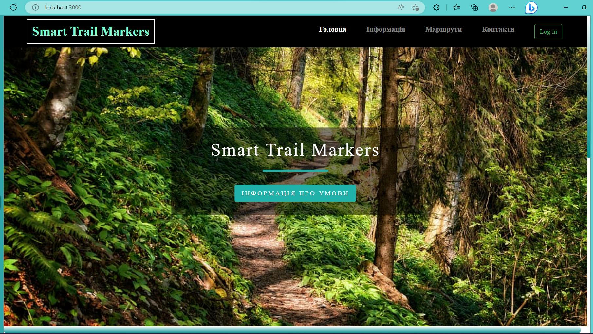

# smart-trail-markers

## Project Description
The **Smart Trail Markers** project aims to enhance outdoor navigation by providing intelligent and interactive trail markers. This is a system of smart trail markers for monitoring environmental conditions, navigation, informing and tracking tourists, a web application with an intuitive user interface.

## Features
- **Comprehensive Environmental Monitoring**: Collects and displays real-time data on weather conditions and trail activity to ensure safe navigation.
- **Interactive Web Application**: Built using JavaScript (React, Node.js, Express) and PostgreSQL for backend functionality, providing users with access to warnings, trail information, weather updates, and visitor data.
- **Customizable Insights**: Offers dashboards (powered by Material UI) for detailed analysis of trail conditions, including historical data for specific times and dates.
- **Simulation Integration**: Simulates environmental events and tourist movement using CupCarbon, with data transmission via an MQTT broker for real-time updates.
- **IoT Integration**: Leverages IoT-based smart trail markers for navigation, environment monitoring, and tourist tracking.
- **Future Expansion Potential**:
  - Mobile offline navigation app with real-time safety notifications and user-contributed route updates.
  - Administrative dashboard with advanced analytics, charts, and tables for managing the trail system.
  - Development of a wearable device with LoRa modules for autonomous navigation and safety alerts, independent of external networks.

## Installation Instructions

Follow these steps to set up and run the **Smart Trail Markers** web application, which allows users to view system information, routes, markers, weather conditions, and visitor data, as well as receive safety notifications.

### 1. Prerequisites
To run the application, you need to have the following installed on your system:
- **Node.js**: A JavaScript runtime environment. [Download here](https://nodejs.org/)
- **PostgreSQL**: An open-source relational database. [Download here](https://www.postgresql.org/)
- **npm packages**: `pg` and `express`

### 2. Setting Up the Environment
1. Clone the repository and navigate to the project directory:
   ```bash
   git clone https://github.com/SofiaPokotylo/smart-trail-markers.git
   cd smart-trail-markers
2. Install project dependencies:
   ```bash
   npm install
3. Install additional required packages for database and server:
   ```bash
   npm i express pg
### 3. Deployment and Configuration
1. Start the PostgreSQL database.
2. Run the API server (backend) from the project root directory:
   ```bash
   node index.js
3. Start the React application:
   ```bash
   npm start
4. Application Overview
* The application consists of four main pages:
  * Home Page: Provides links to system information and highlights the core features of the Smart Trail Markers project.
    &nbsp;
  * Information Page: Displays real-time and historical data about weather conditions and trail visits, including warning banners for critical conditions. Users can filter data by date and time.
    * Weather Conditions<br/> 
    &nbsp;
    * Attendance<br/>
    &nbsp;
  * Routes Page: Shows detailed information about hiking routes, including marker statuses and locations.
    * Routes<br/>
    &nbsp;
    * Markers<br/>
    &nbsp;
  * Additional Features: Offers functionality to explore weather and visitor data with customizable filters and historical records.
    Date and Time Selection<br/> 
    &nbsp;
5. CupCarbon scheme
    * Scheme of markers<br/>
    &nbsp;
    * Capturing an object with a motion sensor<br/>
    &nbsp;
